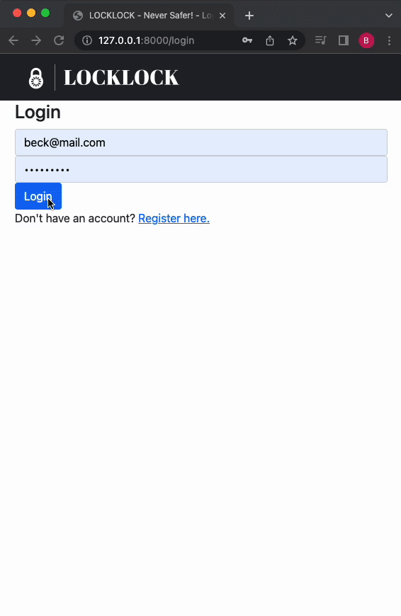

# URL Shortener

### Requirements 
    • Python
    • random, django

## Running the code
1. Ensure that random and django libraries are installed
2. At the file location, create the database by runining
    • Terminal commands: `python manage.py makemigrations bike` and `python manage.py migrate`
3. Start the local server
    • Terminal commands: `python mamage.py runserver`

## Tutorial
1. Create an account
2. Login
3. Select an availble lot (green)
4. Press Lock/Unlock!
